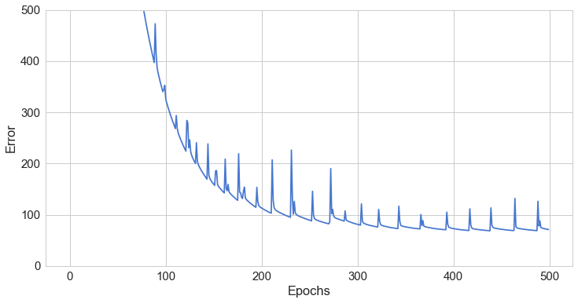

# Generalizing to a Deep NN

After following [this tutorial](https://medium.com/@curiousily/tensorflow-for-hackers-part-iv-neural-network-from-scratch-1a4f504dfa8), I accepted the author's challenge and extended
the neural network from having a fixed number of layers to a variable number of layers, each with
a variable number of nodes.  


```python
import numpy as np
import matplotlib.pyplot as plt
import seaborn as sns
from pylab import rcParams

# Found these on tutorial author's Github
from preprocessing import *
from math_utils import *
from plotting import *

%matplotlib inline

sns.set(style='whitegrid', palette='muted', font_scale=1.5)

rcParams['figure.figsize'] = 12, 6

RANDOM_SEED = 42

np.random.seed(RANDOM_SEED)

IMAGES_PATH = 'train-images-idx3-ubyte'
LABELS_PATH = 'train-labels-idx1-ubyte'

N_FEATURES = 28 * 28
N_CLASSES = 10
```


```python
class DeepNNClassifier:
    
    # These params are pretty standard for a NN classifier, I think TF is very similar
    def __init__(self, n_classes, n_features, hidden_layers=[30],
                 l1=0.0, l2=0.0, epochs=500, learning_rate=0.01,
                 n_batches=1, random_seed=None):
        
        # Recall that a random seed was set at the beginning so this is an optional param
        if random_seed:
            np.random.seed(random_seed)
        self.n_classes = n_classes
        self.n_features = n_features
        self.hidden_layers = hidden_layers
        self.weights = self._init_weights()
        self.l1 = l1
        self.l2 = l2
        self.epochs = epochs
        self.learning_rate = learning_rate
        self.n_batches = n_batches
        # This holds the gradients for each weight
        self.grads = [0 for z in self.weights]
        
    def _init_weights(self):
        weights = []       
        # first_weights connects the input layer to the first hidden layer
        first_weights = np.random.uniform(-1.0, 1.0, 
                               size=self.hidden_layers[0] * (self.n_features + 1))
        first_weights = first_weights.reshape(self.hidden_layers[0], self.n_features + 1)
        weights.append(first_weights)
        
        # This loop should produce all hidden layers except those which touch input/output layers
        for i in range(0, len(self.hidden_layers)):
            if i+1 < len(self.hidden_layers):
                next_weights = np.random.uniform(-1.0, 1.0, 
                                                 size=(self.hidden_layers[i] + 1) * self.hidden_layers[i+1])
                next_weights = next_weights.reshape(self.hidden_layers[i] + 1, self.hidden_layers[i+1])
                weights.append(next_weights)
        
        # final_weights connects the final hidden layer to the output layer
        final_weights = np.random.uniform(-1.0, 1.0,
                                         size=self.n_classes * (self.hidden_layers[-1] + 1))
        final_weights = final_weights.reshape(self.n_classes, self.hidden_layers[-1] + 1)
        weights.append(final_weights)
        return weights
        
    def _add_bias_unit(self, X, how='column'):
        # This adds a bias unit to either the first or second dimension of the input X
        if how == 'column':
            X_new = np.ones((X.shape[0], X.shape[1] + 1))
            X_new[:, 1:] = X
        elif how == 'row':
            X_new = np.ones((X.shape[0] + 1, X.shape[1]))
            X_new[1:, :] = X
        return X_new
        
    # This represents a forward pass
    def _forward(self, X):
        # These hold the unactivated and activated hidden layers
        net_hiddens = [0 for z in self.hidden_layers]
        act_hiddens = [0 for z in self.hidden_layers]
        # Add a bias unit to X input
        net_input = self._add_bias_unit(X, how='column')
        # Initial values of hidden layer
        net_hiddens[0] = self.weights[0].dot(net_input.T)
        # Sigmoid is our activation function
        act_hiddens[0] = sigmoid(net_hiddens[0])
        # Add a bias unit to the hidden layer (on a row because each row is a node in layer)
        act_hiddens[0] = self._add_bias_unit(act_hiddens[0], how='row')
        # for each weight, apply to previous activated hidden layer and propagate forward
        for i in range(1, len(self.weights)-1):
            net_hiddens[i] = self.weights[i].T.dot(act_hiddens[i-1])
            act_hiddens[i] = sigmoid(net_hiddens[i])
            act_hiddens[i] = self._add_bias_unit(act_hiddens[i], how='row')
        # Output is last set of weights applied to activated hidden layer
        net_out = self.weights[-1].dot(act_hiddens[-1])
        # Simply apply activation to output
        act_out = sigmoid(net_out)
        return net_input, net_hiddens, act_hiddens, net_out, act_out
    
    # This is the backward pass
    def _backward(self, net_input, net_hiddens, act_hiddens, act_out, y):
        # This holds the sigmas for each layer
        self.sigmas = []
        # Params to this function are results of forward
        # sigma_final can be considered the error
        sigma_final = act_out - y
        self.sigmas.append(sigma_final)
        
        net_hiddens[-1] = self._add_bias_unit(net_hiddens[-1], how='row')
        sigma = self.weights[-1].T.dot(self.sigmas[-1]) * sigmoid_prime(net_hiddens[-1])
        sigma = sigma[1:, :]
        self.sigmas.append(sigma)
        # This loop calculates all the sigma values
        for i in range(len(net_hiddens)-2, -1, -1):
            net_hiddens[i] = self._add_bias_unit(net_hiddens[i], how='row')
            sigma = self.weights[i+1].dot(self.sigmas[-1]) * sigmoid_prime(net_hiddens[i])
            sigma = sigma[1:, :]
            self.sigmas.append(sigma)
        # Must reverse the list since sigma_final will be at the head and we are backward propagating
        self.sigmas.reverse()
        # The first grad uses net_input
        self.grads[0] = self.sigmas[0].dot(net_input)
        # This loop calculates all the remaining grad values
        for i in range(1, len(self.sigmas)):
            self.grads[i] = self.sigmas[i].dot(act_hiddens[i-1].T)
        return self.grads
    
    def _error(self, y, output):
        #L1-2 Regularization and cross_entropy loss
        L1_term = L1_reg_deep(self.l1, self.weights)
        L2_term = L2_reg_deep(self.l2, self.weights)
        error = cross_entropy(output, y) + L1_term + L2_term
        return np.mean(error) / len(self.hidden_layers)
    
    # This is the backpropagation (includes both a forward and backward pass)
    def _backprop_step(self, X, y):
        net_input, net_hiddens, act_hiddens, net_out, act_out = self._forward(X)
        # y is [n_instances, n_classes], backward assumes the transpose of this
        y = y.T
        grads = self._backward(net_input, net_hiddens, act_hiddens, act_out, y)

        # regularize
        for i in range(0, len(grads)):
            if i == 0 or i == len(grads)-1:
                grads[i][:, 1:] += (self.weights[i][:, 1:] * (self.l1 + self.l2))
            else:
                grads[i][:, 1:] += (self.weights[i].T[:, 1:] * (self.l1 + self.l2))

        error = self._error(y, act_out)
        
        return error, grads
    
    def predict(self, X):
        Xt = X.copy()
        net_input, net_hiddens, act_hiddens, net_out, act_out = self._forward(Xt)
        # mle is defined by the author and does np.argmax(y, axis=1) here to predict
        return mle(net_out.T)
    
    def predict_proba(self, X):
        Xt = X.copy()
        net_input, net_hiddens, act_hiddens, net_out, act_out = self._forward(Xt)
        # softmax gives a probability distribution adding to one across each class
        return softmax(act_out.T)
    
    def fit(self, X, y):
        self.error_ = []
        X_data, y_data = X.copy(), y.copy()
        # one_hot defined by author, returns matrix with one-hot vectors instead of just the correct label
        y_data_enc = one_hot(y_data, self.n_classes)
        for i in range(self.epochs):

            X_mb = np.array_split(X_data, self.n_batches)
            y_mb = np.array_split(y_data_enc, self.n_batches)
            
            epoch_errors = []

            for Xi, yi in zip(X_mb, y_mb):
                
                # update weights
                error, grads = self._backprop_step(Xi, yi)
                epoch_errors.append(error)
                # weights updated using gradient descent
                for i in range(0, len(self.weights)):
                    if i == 0 or i == len(self.weights)-1:
                        self.weights[i] -= (self.learning_rate * grads[i])
                    else:
                        self.weights[i] -= (self.learning_rate * grads[i].T)
            # self.error_ holds the average error across epochs
            self.error_.append(np.mean(epoch_errors))
        return self
    
    def score(self, X, y):
        y_hat = self.predict(X)
        # Calculates the percentage correct across the input
        return np.sum(y == y_hat, axis=0) / float(X.shape[0])
```

That turned out to be a pretty involved refactoring process.  Worth noting is that new L1 and L2 regularization methods are being used but they were creatd in the math_utils file.  Let's see if this model can perform adequately or even better than the previous model.


```python
X, y = read_mnist(IMAGES_PATH, LABELS_PATH)
X, y = shuffle_data(X, y, random_seed=RANDOM_SEED)
X_train, y_train = X[500:], y[500:] # From 500 onward
X_test, y_test = X[:500], y[:500] # First 500 pairs

from sklearn.preprocessing import scale, normalize

X_train_std = scale(X_train.astype(np.float64))
X_test_std = scale(X_test.astype(np.float64))

dnn = DeepNNClassifier(n_classes=N_CLASSES, 
                  n_features=N_FEATURES,
                  hidden_layers=[250, 50, 10],
                  l2=0.50,
                  l1=0.00,
                  epochs=500,
                  learning_rate=0.001,
                  n_batches=25,
                  random_seed=RANDOM_SEED)

dnn.fit(X_train_std, y_train)
print('Test Accuracy: %.2f%%' % (dnn.score(X_test_std, y_test) * 100))
```

    Test Accuracy: 98.40%


```python
plot_error(dnn)
```





Cool!  So this model was able to crack 98% accuracy, the best of any model in this notebook, but the error graph is puzzling.  Why does the error spike up and down every ~20-25 epochs?  I'll have to examine this more closely, since solving this could allow for quicker convergence and thus better accuracy on the same number of epochs.
