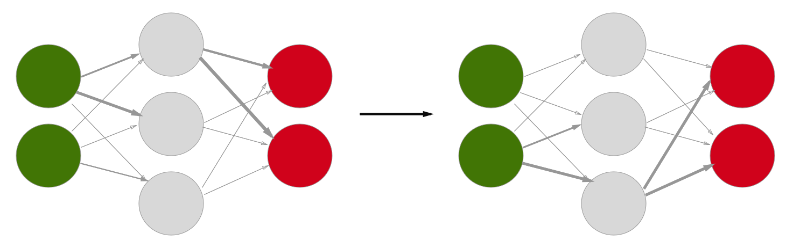
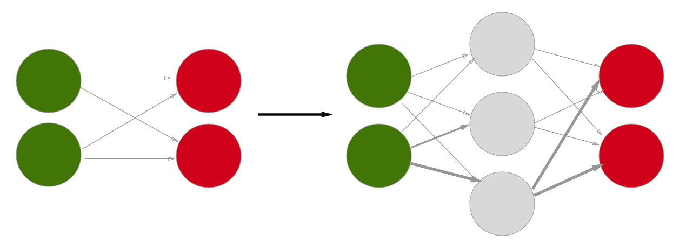

# Using NEAT to Evolve Neural Networks


```python
import MultiNEAT as NEAT
```

This was sort of a pain to install, but the good news is it's all set up now and I have openCV 3.3.0 installed as well.  Basically [this](http://multineat.com/docs.html) is the extent of the documentation since I don't believe this library has been widely used.  It's also not fully compatible with the current `boost` version (1.65) because one of the header files was removed (`numeric.hpp`) so I used `cython` to build it instead (although the new files related to Traits require me to have `boost` installed anyway.

### What is NEAT?

NEAT stands for ["NeuroEvolution of Augmenting Topologies"](https://en.wikipedia.org/wiki/Neuroevolution_of_augmenting_topologies) and is a genetic algorithm for evolving neural networks.  It is based on the idea that mutation, speciation, and natural selection can begin with very simple structures and eventually evolve complex topologies that maximize a given fitness function.

There are really two distinct ways to use NEAT:

    1. Decide on the topology of the neural network ahead of time and simply evolve connection
    weights and biases.



    2. Start with a very simple network consisting of only input and output layers and evolve new nodes
    and connections along with connection weights and biases.



### Evolving a Neural Network That Outputs [1,0]  (A Tutorial)

To get started with NEAT, I am going to go through a toy example.  It will involve initializing a population of simple genomes, constructing neural network phenotypes based on these genomes, defining an evaluation function to determine the fitness of a given phenotype, and defining an epoch cycle to iterate through new generations. (NOTE: This code will primarily come from the [documentation page](http://multineat.com/docs.html))


```python
params = NEAT.Parameters()

params.PopulationSize = 100

# The Genome constructor (in C++) is copied below
# Genome::Genome(unsigned int a_ID,
#                    unsigned int a_NumInputs,
#                    unsigned int a_NumHidden, // ignored for seed type == 0, specifies number of hidden units if seed type == 1
#                    unsigned int a_NumOutputs,
#                    bool a_FS_NEAT, ActivationFunction a_OutputActType,
#                    ActivationFunction a_HiddenActType,
#                    unsigned int a_SeedType,
#                    const Parameters &a_Parameters)

genome = NEAT.Genome(0, 3, 0, 2, False,
                     NEAT.ActivationFunction.UNSIGNED_SIGMOID,
                     NEAT.ActivationFunction.UNSIGNED_SIGMOID, 0, params)  
```

The author of the documentation (likely also the author of the library) tells us to: "Always add one extra input. The last input is always used as bias and also when you activate the network always set the last input to 1.0 (or any other constant non-zero value)." Knowing this, the network we defined just now has 2 'real' inputs and 2 outputs.


```python
# The Population constructor (again in C++) is copied below
# Population::Population(const Genome& a_Seed, const Parameters& a_Parameters,
#     bool a_RandomizeWeights, double a_RandomizationRange, int a_RNG_seed)
pop = NEAT.Population(genome, params, True, 1.0, 0)
```

Now we have a population of 100 simple neural network genomes with randomized weights.  Next step is to define an evaluation function, which will require us to build phenotypes from these genomes.


```python
def evaluate(genome):

    # this creates a neural network (phenotype) from the genome
    net = NEAT.NeuralNetwork()
    genome.BuildPhenotype(net)

    # let's input just one pattern to the net, activate it once and get the output
    net.Input( [ 1.0, 0.0, 1.0 ] )
    net.Activate()
    output = net.Output() 

    # the output can be used as any other Python iterable.
    # instead of the original decision to select for '0' output on the first output,
    # I will select for the output [1,0]
    fitness = output[0] + (1 - output[1])
    return fitness
```


```python
for generation in range(10): # run for 10 generations

    # retrieve a list of all genomes in the population
    genome_list = NEAT.GetGenomeList(pop)

    fitness_list = []
    # apply the evaluation function to all genomes
    for genome in genome_list:
        fitness = evaluate(genome)
        fitness_list.append(fitness)
        genome.SetFitness(fitness)

    # Here is where the author recommends to output information on the current generation
    top_fit = sorted(fitness_list)[-1]
    print("Highest fitness in generation " + str(generation) + ": " + str(top_fit))
    print("Percentage of Max Fitness: " + str(top_fit/2.0))

    # advance to the next generation
    pop.Epoch()
```

    Highest fitness in generation 0: 1.3847487012811497
    Percentage of Max Fitness: 0.6923743506405748
    Highest fitness in generation 1: 1.5667443711378604
    Percentage of Max Fitness: 0.7833721855689302
    Highest fitness in generation 2: 1.7236779176066068
    Percentage of Max Fitness: 0.8618389588033034
    Highest fitness in generation 3: 1.7819764915947478
    Percentage of Max Fitness: 0.8909882457973739
    Highest fitness in generation 4: 1.8672971334927315
    Percentage of Max Fitness: 0.9336485667463658
    Highest fitness in generation 5: 1.9253129945621064
    Percentage of Max Fitness: 0.9626564972810532
    Highest fitness in generation 6: 1.9544168711332208
    Percentage of Max Fitness: 0.9772084355666104
    Highest fitness in generation 7: 1.9651953333932402
    Percentage of Max Fitness: 0.9825976666966201
    Highest fitness in generation 8: 1.9723779739344118
    Percentage of Max Fitness: 0.9861889869672059
    Highest fitness in generation 9: 1.976634900085418
    Percentage of Max Fitness: 0.988317450042709


This at least provides good evidence that the library is working as intended, although this problem was so simple that by generation 9 (the 10th generation) the most fit neural network has 99% of maximum fitness (perfect outputs).  However, the massive difference between this task and the training of neural networks in previous notebooks is that these neural networks acted on a single input and tried to match the expected output.  This is like getting a single training example 99% right out of the 60,000 in MNIST and then reporting 99% accuracy.

One could imagine instead providing the neural networks with all the inputs from the UCI dataset or even MNIST, and then seeing how well evolution can develop an accurate regression.  This will be a replacement of backpropagation, with the mechanism for reducing error being the 'natural' selection of weights which produce higher fitness.  This is what I will attempt to do now.

### Evolution vs. Backpropagation


```python
import constants

FILE_NAME = "drug_consumption_data.txt"
NUM_FEATURES = 12

with open(FILE_NAME) as f:
    lines = f.readlines()

features = []
usages = []
cases = []
for line in lines:
    # First elem in line is an id number
    line = line.strip('\n').split(',')[1:]
    feature = line[:NUM_FEATURES]
    usage = line[NUM_FEATURES:]
    features.append(feature)
    usages.append(usage)
    cases.append((feature,usage))
    
def classify_usage(usage_code):
    if usage_code in constants.USER:
        return 1
    else:
        return 0

def process_case(case):
    x, y = case
    return (list(map(float, x)), list(map(classify_usage, y)))
cases = list(map(process_case, cases))
```

The code above is taken directly from my [VisualizingData notebook](https://emdoyle.github.io/tensorflow_stuff/VisualizingData.html) since I like the format of `cases`.  However there is some very annoying work to be done to this data.  Since many of the input features are categorical (gender, country, ethnicity etc.) these need to be encoded into one-hot groups of input nodes.  This means that for example gender information will be distributed across two nodes.  When the case indicates that the participant is Male, the first node will be 1 and the second node will be 0.  This is reversed for Female.

This was done automatically in a couple of the previous notebooks when using TensorFlow's `tf.feature_column.bucketized_column`.  In fact I am just realizing now why those columns were Sparse columns as opposed to real-valued Dense columns.  Anyways this process is important to the accuracy of our classifier (mostly for examples with more than two options however) because we do not want it to think there is a closer relationship between categories which are coded into numbers which are close together versus numbers which are far apart.  Hopefully this makes sense but if not there is a good explanation [here](https://www.researchgate.net/post/How_to_code_categorical_inputs_for_a_neural_network) which is very short and to the point.

I am going to house the pre-processing code which turns our real-valued info into sparse categorical input in [this file](https://github.com/emdoyle/tensorflow_stuff/tree/master/NEAT/utils.py).


```python
import utils
cases = utils.expand_features(cases)
```

Looking at the first entry of cases now, we can see that there is a mix of real values and what appear to be embedded one-hot vectors.  This is the format of our features input now:

000000 | 00 | real | 0000000 | 0000000 | real | real | real | real | real | real | real

where the 0s represent a one-hot vector with the same length.

This leaves us with a new number of input nodes:

6 + 2 + 1 + 7 + 7 + 7(1) = 30 input nodes

We will come back to this information later, but until then we can rest easy that our data is processed exactly as we'd like it.


```python
# Just verifying the math
print(len(cases[0][0]))
```

    30


```python
params = NEAT.Parameters()

params.PopulationSize = 150

params.MinSpecies = 5
params.MaxSpecies = 10
params.RouletteWheelSelection = False
params.RecurrentProb = 0.0
params.OverallMutationRate = 0.8

params.MutateWeightsProb = 0.90

params.WeightMutationMaxPower = 2.5
params.WeightReplacementMaxPower = 5.0
params.MutateWeightsSevereProb = 0.9
params.WeightMutationRate = 0.25

params.MaxWeight = 8

params.MutateAddNeuronProb = 0.03
params.MutateAddLinkProb = 0.05
params.MutateRemLinkProb = 0.0

params.ActivationFunction_SignedSigmoid_Prob = 1.0
params.ActivationFunction_UnsignedSigmoid_Prob = 0.0
params.ActivationFunction_Tanh_Prob = 0.0
params.ActivationFunction_SignedStep_Prob = 0.0

params.CrossoverRate = 0.75  # mutate only 0.25
params.MultipointCrossoverRate = 0.4
params.SurvivalRate = 0.2

params.AllowLoops = False
```

The code above was copied from [this example file](https://github.com/peter-ch/MultiNEAT/blob/master/examples/TestNEAT_xor.py) because it quickly shows me a ton of the possible configurable parameters.  I'll leave them as are for now.

Now onto writing the evaluation function.  The task of this function is to take in a genome, build the corresponding NeuralNetwork phenotype, run through inputs and outputs, calculate error, and return the fitness based on the observed error.  The choice of how to calculate the error is up to me, so this is another place I may modify to get better results later.

Unfortunately, I will be using a built-in function that expects `evaluate` to have this exact function signature, so I can't add another `target` parameter which would allow for easy selection of a target.  Instead I'll use a global variable since it is more visible than changing a variable in `constants.py`.


```python
TARGET = utils.DRUG_INDEXES["cannabis"]

def calc_error(output, usages):
    error = 0
    usages = utils.one_hot(2, usages)
    usage = usages[TARGET]
    
    for i in range(2):
        error += pow(usage[i] - output[i], 2)
    error /= 2
    
    return error

def evaluate(genome):
    net = NEAT.NeuralNetwork()
    genome.BuildPhenotype(net)

    error = 0
    
    for features, usages in cases:
        net.Flush()
        net.Input(features)
        net.Activate()
        o = net.Output()
        error += calc_error(o, usages)
    
    return 1 - (error / len(cases))
```


```python
import time
from MultiNEAT import EvaluateGenomeList_Serial
from MultiNEAT import GetGenomeList, ZipFitness

g = NEAT.Genome(0, 31, 0, 2, False, NEAT.ActivationFunction.UNSIGNED_SIGMOID,
                NEAT.ActivationFunction.UNSIGNED_SIGMOID, 0, params)
pop = NEAT.Population(g, params, True, 1.0, 0)
pop.RNG.Seed(int(time.clock()*100))

generations = 0
for generation in range(50):
    genome_list = NEAT.GetGenomeList(pop)
    fitness_list = EvaluateGenomeList_Serial(genome_list, evaluate, display=False)
    NEAT.ZipFitness(genome_list, fitness_list)
    pop.Epoch()
    generations = generation
    best = max(fitness_list)
    if generation == 0 or (generation+1) % 10 == 0:
        print("Generation: " + str(generation+1) + ", Best fitness: " + str(best))
```

    Generation: 1, Best fitness: 0.7637449188499649
    Generation: 10, Best fitness: 0.7669842512733134
    Generation: 20, Best fitness: 0.7698355346697721
    Generation: 30, Best fitness: 0.7700872097170129
    Generation: 40, Best fitness: 0.7700872097170129
    Generation: 50, Best fitness: 0.7700872097170129


Although 50 Generations is actually not that many for this task, I have tried numerous different configurations and achieved what I would call poor results so far.  I think that the problem may be that the fitness is based on minimizing mean squared error across the samples.  The networks may evolve better if the process is more results-oriented (in the spirit of evolution).  To achieve this I will instead calculate the overall accuracy (using argmax of the two output neurons to compare to the one-hot usage vectors) as fitness for each genome.


```python
def check_output(output, usages):
    usages = utils.one_hot(2, usages)
    usage = usages[TARGET]
    
    if output[0] > output[1]:
        if usage[0] > usage[1]:
            return 1
        else:
            return 0
    else:
        if usage[1] > usage[0]:
            return 1
        else:
            return 0

def evaluate(genome):
    net = NEAT.NeuralNetwork()
    genome.BuildPhenotype(net)

    total_correct = 0
    
    for features, usages in cases:
        net.Flush()
        net.Input(features)
        net.Activate()
        o = net.Output()
        total_correct += check_output(o, usages)
    
    return float(total_correct/len(cases))
```


```python
g = NEAT.Genome(0, 31, 10, 2, False, NEAT.ActivationFunction.SIGNED_SIGMOID,
                NEAT.ActivationFunction.SIGNED_SIGMOID, 0, params)
pop = NEAT.Population(g, params, True, 1.0, 0)
pop.RNG.Seed(int(time.clock()*100))

generations = 0
for generation in range(500):
    genome_list = NEAT.GetGenomeList(pop)
    fitness_list = EvaluateGenomeList_Serial(genome_list, evaluate, display=False)
    NEAT.ZipFitness(genome_list, fitness_list)
    pop.Epoch()
    generations = generation
    best = max(fitness_list)
    if generation == 0 or (generation+1) % 10 == 0:
        print("Generation: " + str(generation+1) + ", Best fitness: " + str(best))
```

    Generation: 1, Best fitness: 0.4716180371352785
    Generation: 10, Best fitness: 0.4880636604774536
    Generation: 20, Best fitness: 0.4880636604774536
    Generation: 30, Best fitness: 0.4880636604774536
    Generation: 40, Best fitness: 0.4880636604774536
    Generation: 50, Best fitness: 0.4880636604774536
    Generation: 60, Best fitness: 0.4880636604774536
    Generation: 70, Best fitness: 0.4880636604774536
    Generation: 80, Best fitness: 0.4880636604774536
    Generation: 90, Best fitness: 0.48859416445623344
    Generation: 100, Best fitness: 0.48859416445623344
    Generation: 110, Best fitness: 0.48859416445623344
    Generation: 120, Best fitness: 0.48859416445623344
    Generation: 130, Best fitness: 0.48859416445623344
    Generation: 140, Best fitness: 0.48859416445623344
    Generation: 150, Best fitness: 0.48859416445623344
    Generation: 160, Best fitness: 0.48859416445623344
    Generation: 170, Best fitness: 0.48859416445623344
    Generation: 180, Best fitness: 0.48859416445623344
    Generation: 190, Best fitness: 0.48859416445623344
    Generation: 200, Best fitness: 0.48859416445623344
    Generation: 210, Best fitness: 0.48859416445623344
    Generation: 220, Best fitness: 0.48859416445623344
    Generation: 230, Best fitness: 0.48859416445623344
    Generation: 240, Best fitness: 0.48859416445623344
    Generation: 250, Best fitness: 0.48859416445623344
    Generation: 260, Best fitness: 0.48859416445623344
    Generation: 270, Best fitness: 0.48859416445623344
    Generation: 280, Best fitness: 0.48859416445623344
    Generation: 290, Best fitness: 0.48859416445623344
    Generation: 300, Best fitness: 0.48859416445623344
    Generation: 310, Best fitness: 0.48859416445623344
    Generation: 320, Best fitness: 0.48859416445623344
    Generation: 330, Best fitness: 0.48859416445623344
    Generation: 340, Best fitness: 0.4891246684350133
    Generation: 350, Best fitness: 0.4891246684350133
    Generation: 360, Best fitness: 0.4891246684350133
    Generation: 370, Best fitness: 0.4891246684350133
    Generation: 380, Best fitness: 0.4891246684350133
    Generation: 390, Best fitness: 0.4891246684350133
    Generation: 400, Best fitness: 0.4891246684350133
    Generation: 410, Best fitness: 0.4891246684350133
    Generation: 420, Best fitness: 0.4891246684350133
    Generation: 430, Best fitness: 0.4891246684350133
    Generation: 440, Best fitness: 0.4891246684350133
    Generation: 450, Best fitness: 0.4891246684350133
    Generation: 460, Best fitness: 0.4891246684350133
    Generation: 470, Best fitness: 0.4891246684350133
    Generation: 480, Best fitness: 0.4891246684350133
    Generation: 490, Best fitness: 0.4891246684350133
    Generation: 500, Best fitness: 0.4891246684350133


This is pretty terrible.  I can't tell if the Genome just starts out as such a terrible classifier that random mutations will take too long to find a good solution or if I have implemented some part of the process incorrectly.

Actually, after looking at the source code for `Parameters`, I found what may be the problem: stagnation!  As the process is implemented, after 50 generations without an improvement in a species, the species dies off.  This is a problem if I don't expect improvements at such a quick pace.  I will re-run the same experiment with a stagnation period of 500 generations (effectively disabling stagnation).


```python
params.SpeciesMaxStagnation = 500

g = NEAT.Genome(0, 31, 10, 2, False, NEAT.ActivationFunction.SIGNED_SIGMOID,
                NEAT.ActivationFunction.SIGNED_SIGMOID, 0, params)
pop = NEAT.Population(g, params, True, 1.0, 0)
pop.RNG.Seed(int(time.clock()*100))

generations = 0
for generation in range(500):
    genome_list = NEAT.GetGenomeList(pop)
    fitness_list = EvaluateGenomeList_Serial(genome_list, evaluate, display=False)
    NEAT.ZipFitness(genome_list, fitness_list)
    pop.Epoch()
    generations = generation
    best = max(fitness_list)
    if generation == 0 or (generation+1) % 10 == 0:
        print("Generation: " + str(generation+1) + ", Best fitness: " + str(best))
```

    Generation: 1, Best fitness: 0.4716180371352785
    Generation: 10, Best fitness: 0.4870026525198939
    Generation: 20, Best fitness: 0.4870026525198939
    Generation: 30, Best fitness: 0.4870026525198939
    Generation: 40, Best fitness: 0.4870026525198939
    Generation: 50, Best fitness: 0.4870026525198939
    Generation: 60, Best fitness: 0.4870026525198939
    Generation: 70, Best fitness: 0.4870026525198939
    Generation: 80, Best fitness: 0.4870026525198939
    Generation: 90, Best fitness: 0.4870026525198939
    Generation: 100, Best fitness: 0.4870026525198939
    Generation: 110, Best fitness: 0.4870026525198939
    Generation: 120, Best fitness: 0.4870026525198939
    Generation: 130, Best fitness: 0.48753315649867374
    Generation: 140, Best fitness: 0.48753315649867374
    Generation: 150, Best fitness: 0.48753315649867374
    Generation: 160, Best fitness: 0.48753315649867374
    Generation: 170, Best fitness: 0.48753315649867374
    Generation: 180, Best fitness: 0.48753315649867374
    Generation: 190, Best fitness: 0.48753315649867374
    Generation: 200, Best fitness: 0.48753315649867374
    Generation: 210, Best fitness: 0.4880636604774536
    Generation: 220, Best fitness: 0.4880636604774536
    Generation: 230, Best fitness: 0.4880636604774536
    Generation: 240, Best fitness: 0.4880636604774536
    Generation: 250, Best fitness: 0.4880636604774536
    Generation: 260, Best fitness: 0.4880636604774536
    Generation: 270, Best fitness: 0.4880636604774536
    Generation: 280, Best fitness: 0.4880636604774536
    Generation: 290, Best fitness: 0.4880636604774536
    Generation: 300, Best fitness: 0.4880636604774536
    Generation: 310, Best fitness: 0.4880636604774536
    Generation: 320, Best fitness: 0.4880636604774536
    Generation: 330, Best fitness: 0.4880636604774536
    Generation: 340, Best fitness: 0.4880636604774536
    Generation: 350, Best fitness: 0.4880636604774536
    Generation: 360, Best fitness: 0.4880636604774536
    Generation: 370, Best fitness: 0.4880636604774536
    Generation: 380, Best fitness: 0.4880636604774536
    Generation: 390, Best fitness: 0.4880636604774536
    Generation: 400, Best fitness: 0.4880636604774536
    Generation: 410, Best fitness: 0.4880636604774536
    Generation: 420, Best fitness: 0.4880636604774536
    Generation: 430, Best fitness: 0.4880636604774536
    Generation: 440, Best fitness: 0.4880636604774536
    Generation: 450, Best fitness: 0.4880636604774536
    Generation: 460, Best fitness: 0.4880636604774536
    Generation: 470, Best fitness: 0.4880636604774536
    Generation: 480, Best fitness: 0.4880636604774536
    Generation: 490, Best fitness: 0.4880636604774536
    Generation: 500, Best fitness: 0.4880636604774536


That did _NOT_ work.  I think this is a pretty strong signal that this library is not going to be a good alternative to backpropagation for me.  The only way I can think of to give it another chance is to figure out how to load in an already-trained Genome so that NEAT can focus on evolving the topology of the network and ignore the weights.  Actually I lied, I have one other idea that I saw on [HN](https://news.ycombinator.com) a week or so ago, which is to use NEAT solely to evolve hyperparameters (like learning rate, activation function, number of hidden nodes) as a tuple.  I don't think this library is flexible enough to do something like that, but it would be relatively easy to put it together myself.  However that kind of process would be very time-consuming to run and would likely bump accuracy a few points at the most (it is a polishing step).  These ideas both represent a continued investment in this algorithm which I am not interested in making.  It was cool to see it work on the tiny toy case and I saw first-hand that it does not beat gradient-descent given a similar timeframe.
